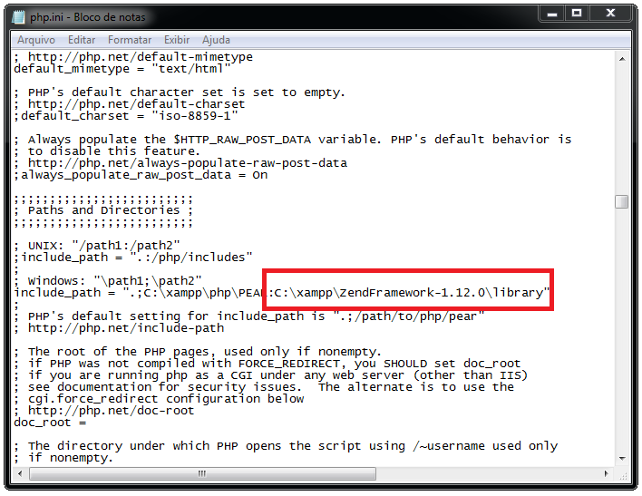
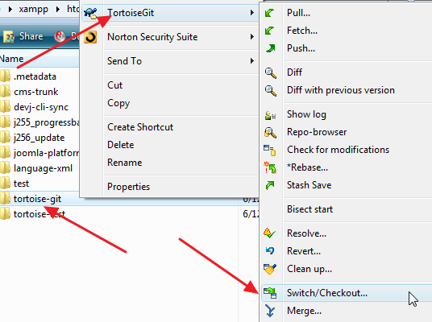
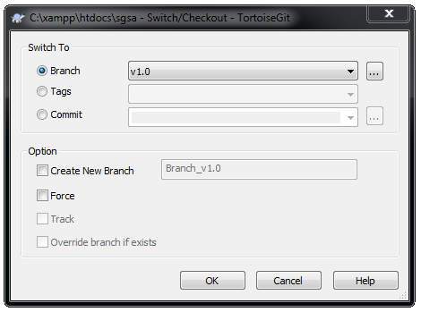
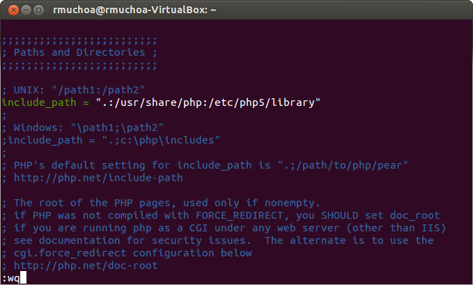
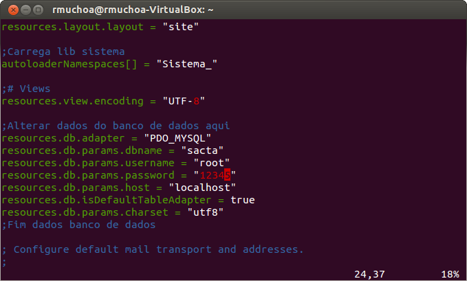

================================
Tutorial de Instalação
================================

Aqui apresentamos como instalar o SGSA:

* em `Windows`_
* em `Ubuntu Linux`_

Windows
================================

Para instalar a aplicação `SGSA`_ em um Windows SO, primeiramente e necessário instalar algumas ferramentas em seu computador, para preparar um ambiente que suporte a aplicação.

1. Faça o download da ferramenta `Xampp`_ para o seu computador, através da página `http://www.apachefriends.org/pt_br/xampp-windows.html#2287`_, e instale-a em sua máquina.

- Se baixar o Xampp em um arquivo compactado, simplesmente descompacte ele em seu disco rígido aonde preferir.
- Se baixar o instalador do Xampp, execute-o e siga os passos até instalar a ferramenta em seu computador.

2. Após instalado o Xampp na sua máquina, um painel de controle da ferramenta sera aberto, com algumas funcionalidades de gerenciamento dos servicos disponíveis. Peça para iniciar o Apache e o MySql clicando no botão **Start**.

.. figure:: xampp-control.png
   :align: center

	*O Painel de Controle do Xampp*

3. Faça o download do `Zend Framework`_ versão *full* para o seu computador, através da página `http://framework.zend.com/downloads/latest`_, para disponibilizar a tecnologia junto com o php.

4. Instale o Zend Framework no local desejado, de maneira que ele seja acessível dentro do computador (instale dentro do diretório do Xampp, ou em uma pasta própria para libraries).

5. Acesse o diretório do framework e entre na pasta *'extras/library/'* e copie a biblioteca **ZendX** para a pasta *'library/'* dentro do diretório do Zend Framework.

6. Acesse o arquivo **php.ini** que pode ser encrontrado dentro do Xampp na pasta *'php/'*, para integrar o Zend com o php.

- procure o atributo **include_path** dentro do arquivo, e remova o caracter *';'* no início da linha logo apos a referência ao *'Windows'*.
- no final do caminho indicado pela string, acrescente o caracter *';'*  e informe o caminho para a pasta *'library/'* da instalação do Zend Framework realizada no passo 4.

	*Include Path do PHP*

7. Faça o download da ferramenta `TortoiseGit`_ para o seu computador, através da página `http://code.google.com/p/tortoisegit/wiki/Download`_, a fim de clonar o repositório do projeto em seu computador. e instale ela em seu computador executando todos os passos.

8. Procure o diretório de instalação do Xampp, e acesse a pasta *'xampp/htdocs/'* para colocar ali o clone da aplicação no repositorio.

- clique com o botão direito no diretorio *'htdocs/'* e selecione a opcao **Git Clone...**.
- informe o caminho do repositório *https://github.com/sgsaproject/sgsa.git* no campo URL e confirme. 
- após terminado o download e construído o clone do repositório, clique com o botão direito sobre a pasta do projeto para acessar o menu de opções.
- selecione a opção **TortoiseGit** e clique em **Switch/Checkout...**, Altere o Branch para *'v1.0'* e confirme.

	*TortoiseGit Opções*
   

	*Trocando para o Branch da Versão 1.0*

9. Abra o **Prompt de Comando** e procure o diretório de instalação do Xampp instalado no seu computador. 

- Acesse o diretório do projeto na pasta *'htdocs/'*, e entre na pasta 'script' para executar o seguinte comando.

	php setup-db.php
	
- *Esse script php é responsável por configurar o ambiente do banco de dados, criando as tabelas e inserindo alguns dados.*

10. Retorne ao diretório do projeto, e acesse a pasta *'application/configs/'* para ajustar algumas configurações. 

- duplique o arquivo **application.ini.dist**, mantendo o mesmo nome, e remova as extensao *'.dist'*.
- acesse o arquivo e mude o usuário ou senha do banco de dados se deseja cadastrar um usuário ou senha diferentes para o banco de dados do MySql.
- caso seja adotado o usuário **root** padrão do MySql, mantenha o arquivo com as configurações encontradas.

11. Acesse a página do projeto instalado através do link *http://localhost/sgsa/public*.

Ubuntu Linux
================================

1. Primeiramente instale um servidor `Apache`_ em seu computador através do comando

	sudo apt-get install apache2

2. Depois instale o `PHP`_ para que o apache possa rodar aplicações web em linguagem php, através do comando

	sudo apt-get install php5

- E configure o seu apache para trabalhar com php5, executando o comando

	sudo apt-get install libapache2-mod-php5

3. Depois de instalado o apache com suporte à linguagem php, reinicie o servidor para trabalhar com as novas configurações, executando o comando

	sudo /etc/init.d/apache2 restart

4. Após reiniciado o servidor, instale o `Git`_ para interagir com o repositório da aplicação, com o comando

	sudo apt-get install git-core

5. Instale também o `SVN`_ para baixar algumas bibliotecas necessárias ao projeto

	sudo apt-get install subversion libapache2-svn

6. Instale o `Zend Framework`_ em seu computador com os seguintes comandos

  	svn checkout --quiet http://framework.zend.com/svn/framework/standard/trunk/library/Zend/ /etc/php5/library/Zend/
	svn checkout --quiet http://framework.zend.com/svn/framework/extras/trunk/library/ZendX/ /etc/php5/library/ZendX/

7. Integre a biblioteca do framework com o servidor, configurando o arquivo **php.ini**

- acesse o arquivo

	vi /etc/php5/apache2/php.ini

- procure dentro do arquivo uma sessão chamada **Paths and Directories**
- altere a linha onde diz **include_path** removendo o caracter *';'* no início da linha e acrescentanto **:/etc/php5/library** antes da última aspa
- saia do arquivo apertando *'esc'* e digitando *':wq'*	para salvar as alterações

	*Arquivo do php.ini*

8. Instale o `MySql`_ como o seu servidor de banco de dados com o comando

	sudo apt-get install mysql-server

- escolha uma senha para o usuário **root** do mysql 

9. Instale um modulo do mysql para integrar com o servidor php

	sudo apt-get install php5-mysql

10. Clone o repositório do `SGSA`_ no github executando o comando

	git clone https://github.com/sgsaproject/sgsa.git /var/www/sgsa

11. Troque o repositório do branch *'master'* para o branch *'v1.0'*, seguindo os seguintes passos

- Navegue até o diretório do clone do projeto

	cd ../../var/www/sgsa/

- Faça o checkout para o outro branch do projeto

	git checkout v1.0

12. Execute um script php para realizar as construções do ambiente de dados, criando as tabelas e inserindo os dados

	php script/setup-db.php

13. Ative o arquivo **aplication.ini** que contém algumas configurações para o ambiente da aplicação

	cp application/configs/application.ini.dist application/configs/application.ini

14. Acesse o arquivo **application.ini** para realizar alguns ajustes de configuração

	vi application/configs/application.ini

15. Altere o atributo senha do usuário **root** do banco de dados, informando a senha cadastrada anteriormente na instalação do mysql

	*Configuração de Senha de Banco*

16. Acesse o navedador de internet instalado no computador, e acesse o domínio *'localhost/sgsa/public'*	

.. Windows: #Windows
.. Ubuntu Linux: #Ubuntu Linux

.. _SGSA: https://github.com/sgsaproject/sgsa

.. _Apache: http://www.apache.org/
.. _PHP: http://www.php.net/
.. _Git: http://git-scm.com/
.. _SVN: http://subversion.apache.org/
.. _Zend Framework: http://framework.zend.com

.. _Xampp: http://www.apachefriends.org/pt_br/xampp.html
.. _TortoiseGit: http://code.google.com/p/tortoisegit/

.. _http://www.apachefriends.org/pt_br/xampp-windows.html#2287: http://www.apachefriends.org/pt_br/xampp-windows.html#2287
.. _http://framework.zend.com/downloads/latest: http://framework.zend.com/downloads/latest
.. _http://code.google.com/p/tortoisegit/wiki/Download: http://code.google.com/p/tortoisegit/wiki/Download
