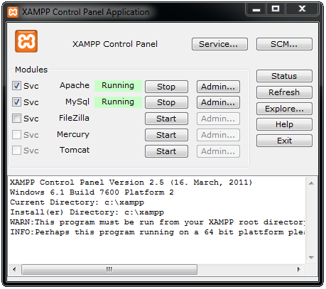

================================
Tutorial de Instalação
================================

Aqui apresentamos como instalar o SGSA:

* em `Windows`_
* em `Ubuntu Linux`_

Windows
================================

Para instalar a aplicação SGSA em um Windows SO, primeiramente e necessário instalar algumas ferramentas em seu computador, para preparar um ambiente que suporte a aplicação.

1) Faça o download da ferramenta `Xampp`_ para o seu computador, através da página `http://www.apachefriends.org/pt_br/xampp-windows.html#2287`_, e instale-a em sua máquina.

- Se baixar o Xampp em um arquivo compactado, simplesmente descompacte ele em seu disco rígido aonde preferir.
- Se baixar o instalador do Xampp, execute-o e siga os passos até instalar a ferramenta em seu computador.

2) Após instalado o Xampp na sua máquina, um painel de controle da ferramenta sera aberto, com algumas funcionalidades de gerenciamento dos servicos disponíveis. Peça para iniciar o Apache e o MySql clicando no botão **Start**.

   *O Painel de Controle do Xampp.*

3) Faça o download do `Zend Framework 1`_ versão *full* para o seu computador, através da página `http://framework.zend.com/downloads/latest`_, para disponibilizar a tecnologia junto com o php.

4) Instale o Zend Framework no local desejado, de maneira que ele seja acessível dentro do computador (instale dentro do diretório do Xampp, ou em uma pasta própria para libraries).

5) Acesse o diretório do framework e entre na pasta *'extras/library/'* e copie a biblioteca **ZendX** para a pasta *'library/'* dentro do diretório do Zend Framework.

6) Acesse o arquivo **php.ini** que pode ser encrontrado dentro do Xampp na pasta *'etc/'*, para integrar o Zend com o php.

- procure o atributo **include_path** dentro do arquivo, e remova o caracter *';'* no início da linha logo apos a referência ao *'Windows'*.
- no final do caminho indicado pela string, acrescente o caracter *':'*  e informe o caminho para a pasta *'library/'* da instalação do Zend Framework realizada no passo 4.

7) Faça o download da ferramenta `TortoiseGit`_ para o seu computador, através da página `http://code.google.com/p/tortoisegit/wiki/Download`_, a fim de clonar o repositório do projeto em seu computador. e instale ela em seu computador executando todos os passos.

8) Procure o diretório de instalação do Xampp, e acesse a pasta *'xampp/htdocs/'* para colocar ali o clone da aplicação no repositorio.

- clique com o botão direito no diretorio *'htdocs/'* e selecione a opcao **Git Clone...**.
- informe o caminho do repositório *https://github.com/sgsaproject/sgsa.git* no campo URL e confirme. 
- após terminado o download e construído o clone do repositório, clique com o botão direito sobre a pasta do projeto para acessar o menu de opções.
- selecione a opção **TortoiseGit** e clique em **Switch/Checkout...**, Altere o Branch para *'v1.0'* e confirme.

9) Abra o **Prompt de Comando** e procure o diretório de instalação do Xampp instalado no seu computador. 

- Acesse o diretório do projeto na pasta *'htdocs/'*, e entre na pasta 'script' para executar o seguinte comando.

	php setup-db.php
	
Esse script php é responsável por configurar o ambiente do banco de dados, criando as tabelas e inserindo alguns dados.

10) Retorne ao diretório do projeto, e acesse a pasta *'application/configs/'* para ajustar algumas configurações. 

- duplique o arquivo **application.ini.dist**, mantendo o mesmo nome, e remova as extensao *'.dist'*.
- acesse o arquivo e mude o usuário ou senha do banco de dados se deseja cadastrar um usuário ou senha diferentes para o banco de dados do MySql.
- caso seja adotado o usuário **root** padrão do MySql, mantenha o arquivo com as configurações encontradas.

11) Acesse a página do projeto instalado através do link *http://localhost/sgsa/public*.

Ubuntu Linux
================================

.. Windows: #Windows
.. Ubuntu Linux: #Ubuntu Linux

.. _Xampp: http://www.apachefriends.org/pt_br/xampp.html
.. _http://www.apachefriends.org/pt_br/xampp-windows.html#2287: http://www.apachefriends.org/pt_br/xampp-windows.html#2287

.. _Zend Framework 1: http://framework.zend.com
.. _http://framework.zend.com/downloads/latest: http://framework.zend.com/downloads/latest

.. _TortoiseGit: http://code.google.com/p/tortoisegit/
.. _http://code.google.com/p/tortoisegit/wiki/Download: http://code.google.com/p/tortoisegit/wiki/Download
